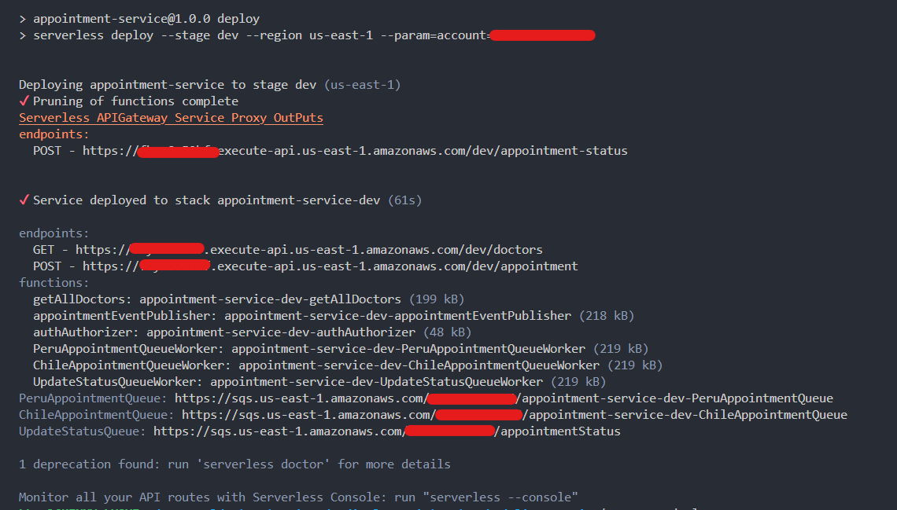

# Medical appointment scheduling service

## 1. Diseño de Arquitectura

Para este sistema de agendamiento de citas médicas, propongo una arquitectura serverless basada en eventos utilizando los siguientes servicios de AWS:


1. **API Gateway**: Expone una API REST que permite a los usuarios registrar, consultar y actualizar citas médicas.
2. **Lambda Functions**: Procesan los eventos de la API Gateway y ejecutan la lógica de negocio específica por país.
3. **DynamoDB**: Almacena la información de las citas médicas y los usuarios.
3. **EventBridge**: Para que el eventBus enrute segun país.
4. **SQS (Simple Queue Service)**: Para manejar de forma asincrona las solicitudes y proteger la BD.
5. **CloudWatch**: Monitorea el sistema y genera alertas en caso de errores o problemas de rendimiento.

## 2. Manejo de Datos

La estructura de datos en DynamoDB esta dado por el diseño de tabla única STD:


En la carpeta assets se encuentra el archivo STD Medical Appointment.xlsx para una mejor visualización

Se tienen los siguientes patrones de acceso 

### Medical appointment scheduling service business use case

* Create a appointment  medical
* Update State of a appointment
* Get doctors by country and specialty
* Get doctors info
* Get Patient INFO
* Consult appointments of user
* Consult appointments of doctor
* Check Availabilty appointment of doctor
..


## 3. Procesamiento por País

Para manejar la lógica específica por país, utilizaré una arquitectura basada en eventos con EventBRidge, SQS y  Lambda Functions. Cuando se recibe una solicitud de agendamiento a través de la API Gateway, se envía un evento a una Lambda Function que se encarga de procesar la solicitud y enviar un evento al eventBus de eventBridge para ser procesada de forma asincrona, mediante una SQS y Lambda worker que dependiendo de las reglas que apliquen por país tomen ciertos procesos.

Para agregar un nuevo país al sistema, bastaría con crear una nueva SQS Worker y Lambda Function que implemente la lógica de ese país y configurar las reglas en el eventBus con el nuevo país.

## 4. Escalabilidad y Rendimiento

La arquitectura propuesta es altamente escalable, ya que cada componente se escala de forma independiente:

- **API Gateway**: Escala automáticamente para manejar variaciones en el tráfico.
- **Lambda Functions**: Se ejecutan bajo demanda y se escalan automáticamente según la carga.
- **DynamoDB**: Es un servicio de base de datos altamente escalable y de alto rendimiento.
- **SQS**: Para manejar de froma asicrona ciertas peticiones no críticas.
Para mejorar el rendimiento, se podría implementar un sistema de caché utilizando ElastiCache (Redis) para almacenar datos de consulta frecuente, como disponibilidad de doctores.


## 5. Seguridad y Cumplimiento

Para asegurar la protección de datos sensibles, se aplicarán las siguientes medidas:

- **Autenticación y Autorización**: Utilizaré Custom Authorizer para gestionar la identidad y el acceso de los usuarios.
- **Cifrado de Datos**: Todos los datos almacenados en DynamoDB y en tránsito se cifrarán utilizando claves de cifrado administradas por AWS.
- **Registros y Auditoría**: Integraré CloudTrail para monitorear y auditar todas las acciones realizadas en el sistema.
- **Cumplimiento de Normativas**: Al estar separado por país se pueden aplicar los diversos flujos.

## 6. Monitoreo y Manejo de Errores

Para el monitoreo del sistema, se utiliza Amazon CloudWatch con las siguientes funcionalidades:

- **Métricas y Alertas**: Se define métricas clave, como errores de API, duración de Lambda, y alertas para notificar problemas.
- **Registros y Análisis**: Se envia los registros de Lambda, API Gateway y DynamoDB a CloudWatch Logs para su análisis y depuración.
- **Dashboards**: dashboards personalizados para visualizar el estado y el rendimiento general del sistema.

En cuanto al manejo de errores, implementaré las siguientes estrategias:

- **Reintentos Automáticos**: Se Configura las funciones Lambda y la API Gateway para reintentar automáticamente las solicitudes fallidas.
- **Gestión de Excepciones**: Capturaremos y manejaremos de manera adecuada todas las excepciones en las funciones Lambda, brindando respuestas descriptivas a los usuarios.
- **Flujos de Compensación**: En caso de errores en pasos intermedios de una transacción, ejecutaremos flujos de compensación para revertir los cambios y dejar el sistema en un estado consistente.


## Usage

Clone this repository and install dependencies

- Install CLI serverless

    npm install serverless -g

- setting credentials

    aws configure

- deploy

    npm run deploy

This microservice is production ready...! 🚀✨




## Estrctura del proyecto

Se implementa una arquitectura de software Hexagonal para tener aislada la lógica de dominio y el código de infraestructura, esto nos da la modularidad para poder mantener facilmente el código aumentando la flexibilidad y testabilidad para cada DOD.

```bash

├── src
│   ├── functions
│   │   └── getSurvey
│   └── core
│       ├── config
│       │   └── environment.ts
│       ├── app
│       │   ├── schemas
│       │   ├── usecases
│       │   └── ports
│       ├── domain
│       │   ├── models
│       │   └── services
│       │       └── repositories
│       └── infrastructure
│           ├── adapters
│           ├── repositories
│           └── utils
├── test
│   ├── functions
│   │   └── ...
│   └── core
│        └── ...
├── serverless.yml
└── package.json

```


